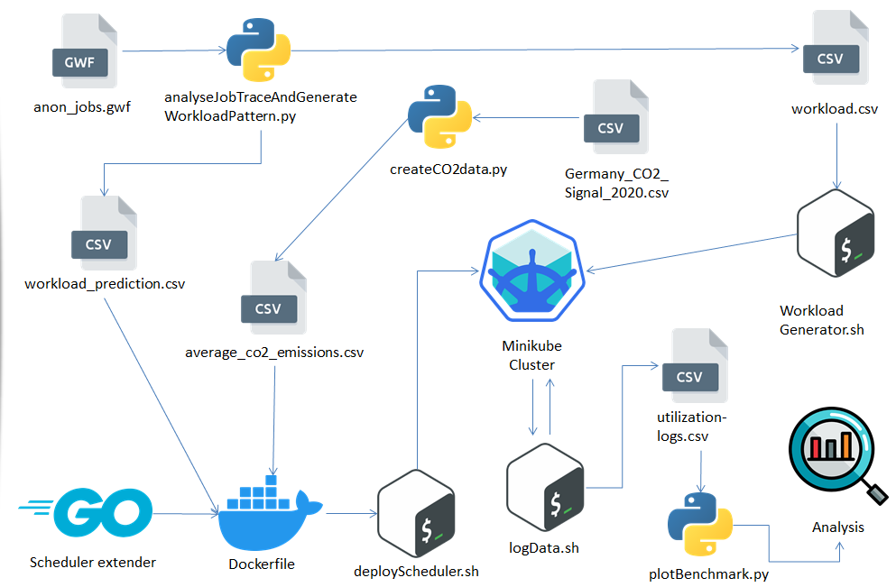

# CO₂ Aware Scheduler for Kubernetes (k8s)

This implementation is based on the [scheduler extender example](https://github.com/everpeace/k8s-scheduler-extender-example)

Documentation of [Kubernetes Scheduler Extender](https://github.com/kubernetes/design-proposals-archive/blob/main/scheduling/scheduler_extender.md)

# 0. Minikube setup

## 0.0 Hardware requirements
- CPU: 2 cores or more
- memory: 16GB +
- free disk space: 30 GB or more
- internet connection
- OS: windows 10 pro Build 21H1 or newer/better

## 0.1 Software requirements
To be able to run the CO2 scheduler, some tools need to be installed to be able to compile, install
and log the behavior of the cluster.
- **Git Bash** can be downloaded [here](https://gitforwindows.org/). It is mandatory for executing bash scripts that are run
for logging and executing benchmark runs.
- **Pyhton 3** Environment for generating performance diagrams and generating workload scenarios.
The recent Python version can be downloaded [here](https://www.python.org/downloads/).
- **Docker** for building the scheduler extender container and uploading it to docker hub for k8s
installation. Follow this [guide](https://docs.docker.com/desktop/windows/install/) for optimal installation.
- **WSL** enabled for performance reasons the installation of docker usingWSL is highly recommended.
- **Minikube** a detailed description of the installation is explained in Section 9.3. Version of Minikube
is fixed to [k8s 1.18.1](https://github.com/kubernetes/minikube/releases/download/v1.18.1/minikube-windows-amd64.exe). 
It has to be noted, that other versions might also work, but changes in
scheduling architecture are not uncommon for k8s.

A Linux based operating system might work, but code has not been tested for this operation.

## 0.2 Minikube installation Guide
The description of installing a matching k8s setup mainly follows the Minikube [get started guide](https://minikube.sigs.k8s.io/docs/start/). 
The prerequisites of successfully installing the Minikube environment are the followin programs mentioned as above: 

git bash, python 3, docker with WSL enabled for performance
reasons. 
Do not use the latest minikube release but [version 1.18.1](https://github.com/kubernetes/minikube/releases/download/v1.18.1/minikube-windows-amd64.exe)

The CO2 scheduler is not implemented for the latest k8s release. 
The main reason is, that a stable version of [k8s Version 1.18.1](https://github.com/kubernetes/minikube/releases/download/v1.18.1/minikube-windows-amd64.exe) had to be picked, as k8s changes versions quite frequently. 
The version of Minikube, and therefore the requirement of k8s itself is version 1.18.1. This Minikube version can
either be downloaded from the [release repository](https://github.com/kubernetes/minikube/releases) or directly following this Link: [minikube 1.18.1](https://github.com/kubernetes/minikube/releases/download/v1.18.1/minikube-windows-amd64.exe).
installer.exe. 
Minikube can be launched out of directory directly with a powershell with admin privileges or anywhere, if the minikube.exe is bound as a local variable. 
For binding the local variable, create a folder named "minikube"directly in the **C:** directory. rename the downloaded
executable file to "minikube.exe". Then the command for binding the path variable in [Minikube get started guide](https://minikube.sigs.k8s.io/docs/start/) can be used to bind Minikube. 
An instance of Minikube can then be simply started in a powershell in the C:/minikube directory by executing **minikube start --cpus 4**.

**Attention!, it has to be noted, that on first start of Minikube, docker desktop needs to be inactive,
as Minikube needs to run directly on WSL instead through the docker daemon for performance
reasons**. 

This is because docker itself is shipped with its own k8s version, that is
performing worse, than the Minikube standalone installation. 
Shutting down the docker deamon ensures, that the setup is performed in the correct way. If warnings of high latency occur while opening the dashboard or enabling the required addon, this is very likely due to a wrong
installation on the docker daemon version. 
Please execute minikube delete and try to reinstall as described. 

Enable the metrics server by entering the following command in console
``minikube addons enable metrics-server``. 
A potential problem here might be, that Minikube will state, that the user performing this action does not have enough permissions to do so. 
Either change the user performing this command, or giving the current user admin privileges for the Windows Hyper-V service. 
Performing this fix will resolve this issue like mentioned. 
For manually inspecting cluster state and correctness of the setup, check the log of the minikube start command and/or
start the k8s dashboard by entering ``minikube dashboard`` to look the current state of the cluster in
a Graphical User Interface (GUI).

# 1. Deploy scheduler
there are two ways for deploying the scheduler.
- Automatically by using a Bash script with git Bash

- Manually by entering all comands one by one in sequence.

**Prequesite for both approaches:**

- Have an Account at https://hub.docker.com/ .
- Create a repository
- execute pyhton scripts that provide necessary data for the scheduler
  - execute **co2_prediction/createCO2data.py**
    - provide the co2 prediction
  - execute **benchmark_scripts/workload_generator/analyseJobTraceAndGenerateWorkloadPattern.py**
    - provides the static workload in **workload_prediction.csv** prediction of the scenario applied later.


## 1.1 Automatically deploy project
- open  **sh deployScheduler.sh**
- adapt the **Image** variable 
  - set it to **USERACCOUNT/REPOSITORYNAME**
- open git bash and enter ``sh deployScheduler.sh``
- wait until the log of scheduling container is opened automatically

### 1.1.0 Test deployed scheduler
- open **Test Pods** folder
- choose one file and deploy on kubernetes
  - execute ``kubectl apply -f FILENAME``
- in Minikube shell execute ``minikube dashboard``
- navigate to pods tab and see if deployment is created and if scheduled


## 1.2 Manually deploy project
Manual deployment process, this is the time consuming but more comprehensible way of deploying.

### 1.2.0 checkout the repo

```shell
$ git clone git@github.com:everpeace/k8s-scheduler-extender-example.git
$ cd k8s-scheduler-extender-example
$ git submodule update --init
```

### 1.2.1. buid a docker image

```
$ IMAGE=YOUR_ORG/YOUR_IMAGE:YOUR_TAG

$ docker build . -t "${IMAGE}"
$ docker push "${IMAGE}"
```

### 1.2.2. deploy `my-scheduler` in `kube-system` namespace
please see ConfigMap in [extender.yaml](extender.yaml) for scheduler policy json which includes scheduler extender config.

```
# bring up the kube-scheduler along with the extender image you've just built
$ sed 's/a\/b:c/'$(echo "${IMAGE}" | sed 's/\//\\\//')'/' extender.yaml | kubectl apply -f -
```

For ease of observation, start streaming logs from the extender:

```console
$ kubectl -n kube-system logs deploy/my-scheduler -c my-scheduler-extender-ctr -f
[  warn ] 2018/11/07 08:41:40 main.go:84: LOG_LEVEL="" is empty or invalid, fallling back to "INFO".
[  info ] 2018/11/07 08:41:40 main.go:98: Log level was set to INFO
[  info ] 2018/11/07 08:41:40 main.go:116: server starting on the port :80
```

Open up an another termianl and proceed.

### 1.2.3. schedule test pod

you will see pods in **Test Pods** folder will be scheduled by `my-scheduler`.

```
$ kubectl create -f TESTPODNAME.yaml

$ kubectl describe pod NAME_SPECIFIED_IN_POD_DESCRIPTION
Name:         test-pod
...
Events:
  Type    Reason                 Age   From               Message
  ----    ------                 ----  ----               -------
  Normal  Scheduled              25s   my-scheduler       Successfully assigned test-pod to minikube
  Normal  SuccessfulMountVolume  25s   kubelet, minikube  MountVolume.SetUp succeeded for volume "default-token-wrk5s"
  Normal  Pulling                24s   kubelet, minikube  pulling image "nginx"
  Normal  Pulled                 8s    kubelet, minikube  Successfully pulled image "nginx"
  Normal  Created                8s    kubelet, minikube  Created container
  Normal  Started                8s    kubelet, minikube  Started container
```


# 2 Benchmark tools & scheduler code
This section gives an overview about the different code snippets and how they work together.


## 2.0 Root directory
important files directly contained in the root directory 

### 2.0.0 predicate.go
contains the main code of the sheduler.
Minor changes on other go code where necessary to call function in intilazation phase.

### 2.0.1 deployScheduler.sh
BASH script used to deploy the scheduler extender on the minikube cluster.
Minor changes in terms of docker hub address might be necessary to make this script working

### 2.0.2 Dockerfile
Builds the scheduler extender code and binds some static files into the right locations.
**workload_prediction.csv** and **average_co2_emissions.csv** are bind here, so dont move these files manually!

If these files are reported missing while deploying the cluster consider rerunning **createCO2data.py** and/or **analyseJobTraceAndGenerateWorkloadPattern.py**.

## 2.1 benchmark_scripts folder
This folder contains all the scripts that where necessary to generate, execute and evaluate the benchmarks for later evaluation

### 2.1.0 logdata/logData.sh 
script that mackes kubectl calls and writes performance metrics into a .csv file called **utilization-logs.csv**

### 2.1.1 logdata/simply_plot.py
directly plots a **utilization-logs.csv** file for debugging purposes

### 2.1.2 logdata/plotBenchmark.py
More sophisticated script that picks a folder with two different log files to compare them against each other.
Do not move this file, it relies on other .csv files in the data structure to work properly!

### 2.1.3 workload_generator/analyseJobTraceAndGenerateWorkloadPattern.py
takes a workload file provided by http://gwa.ewi.tudelft.nl/datasets/gwa-t-10-sharcnet .
The **anon_jobs.gwf** file needs to be directly place on same level as the python script to properly make use of the workload log.

Either [Log 1](http://gwa.ewi.tudelft.nl/datasets/gwa-t-10-sharcnet) or [Log 2](http://gwa.ewi.tudelft.nl/datasets/gwa-t-4-auvergrid) was used.
Outputs
- **workload.csv** which is the benchmark scenario executed later
- **workload_prediction.csv** a static workload prediction that used by the scheduler

### 2.1.4 workload_generator/workloadGenerator.sh
takes the **workload.csv** file and builds dummy pods for the benchmark by utilizing the **idlePod.yaml** template.

### 2.1.5 workload_generator/LegacyworkloadGenerator.sh
Old test implementation for rudimentary implementation checks.


## 2.2 co2_prediction folder
contains the data and script for performing the co2 prediction.

### 2.2.0 createCO2data.py
takes the **Germany_CO2_Signal_2020.csv** file and calculates a CO2 prediction for the year 2021.

### 2.2.1 CO2PrecisionCalculation.py
Calculates the precision the prediction.
**Germany_CO2_Signal_2021.csv** is the gold standard file to compare against.


## 2.3 Test Pods
contains some test pods for manually testing the implementation instead of automated scripts.

simply pick a file you want to deploy it by exectuing: ``kubectl apply -f FILENAME``.


## 3 Execute Benchmark
In the **benchmark_scripts** folder execute the two Bash scripts:
- ``sh log_data/log_data.sh``
- ``sh workload_generator/workloadGenerator.sh``
wait until the workload generator is done, terminate the log script manually.

**Important!** 

Do not log the scheduler while benchmarking (opens automatically after executing **deployScheduler.sh**).

Do not have the minikube dashboard open by executing ``minikube dashboard``


## License
based on https://github.com/everpeace/k8s-scheduler-extender-example
```
This Scheduler was based on the scheduler extender sample provided by
2018 Shingo Omura <https://github.com/everpeace> under the Apache 2.0 license.
